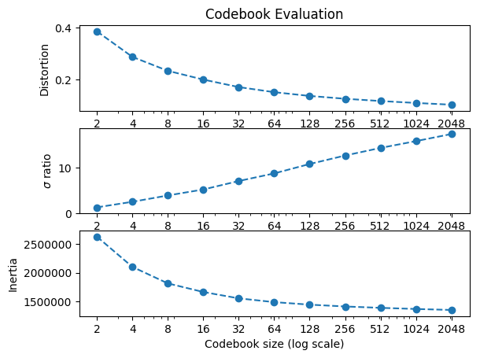
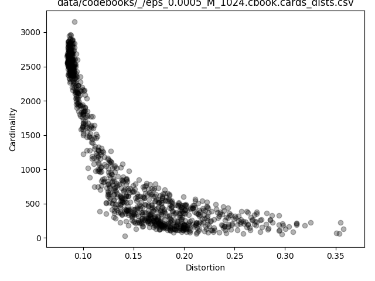
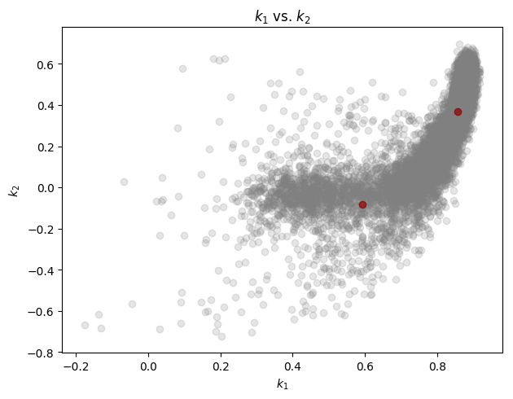
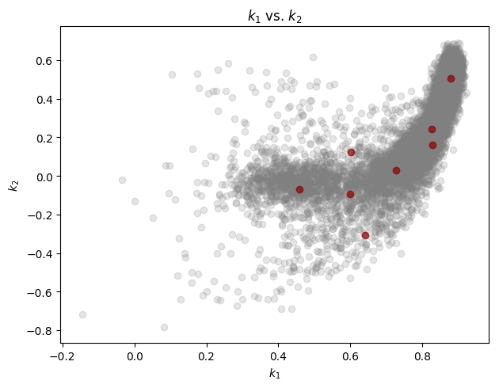
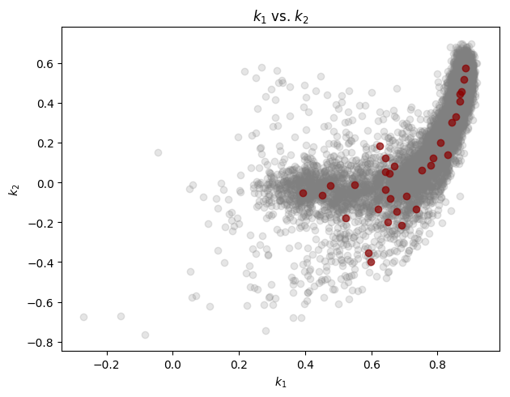
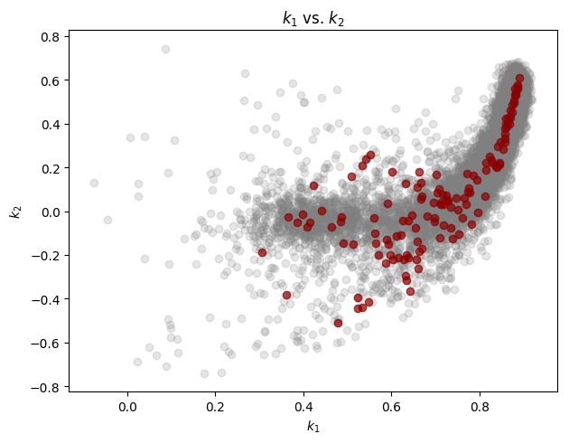
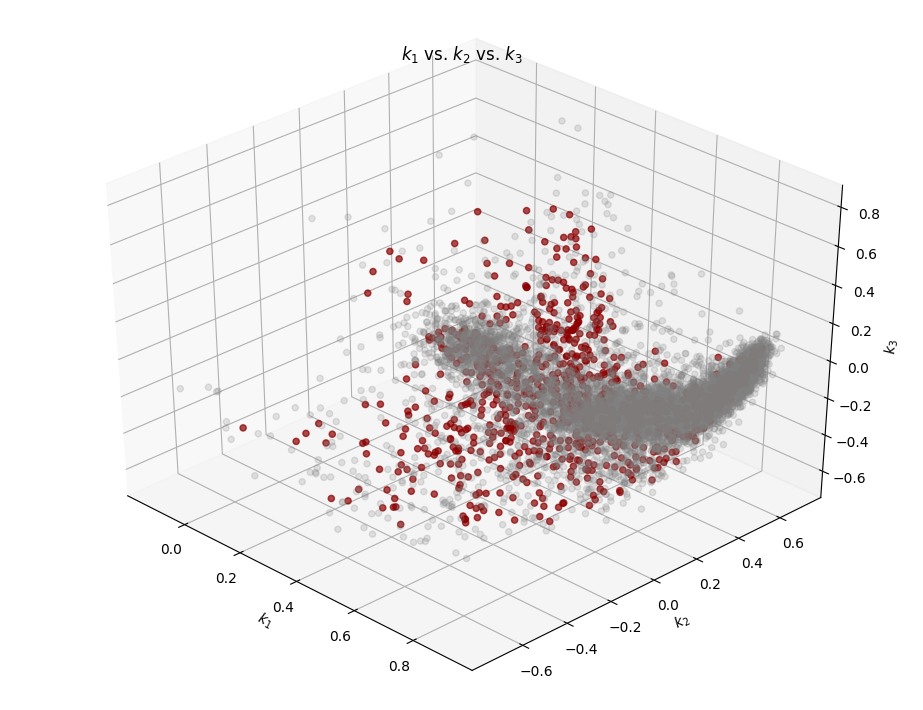
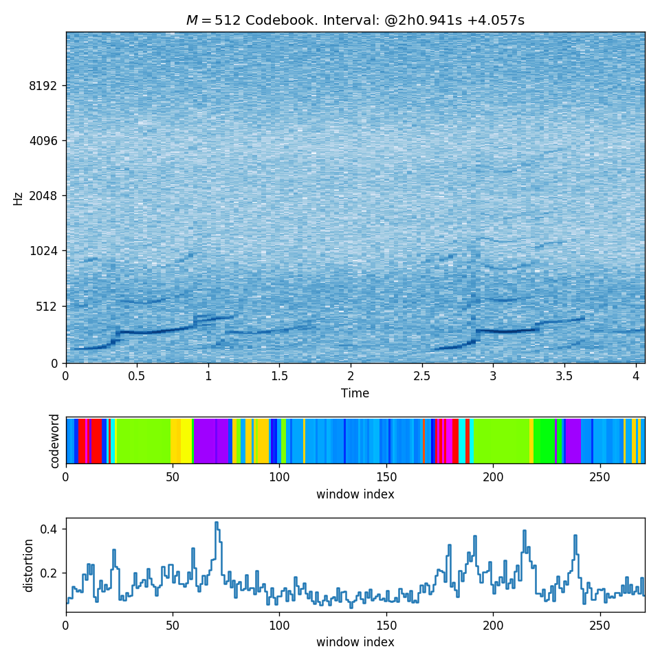
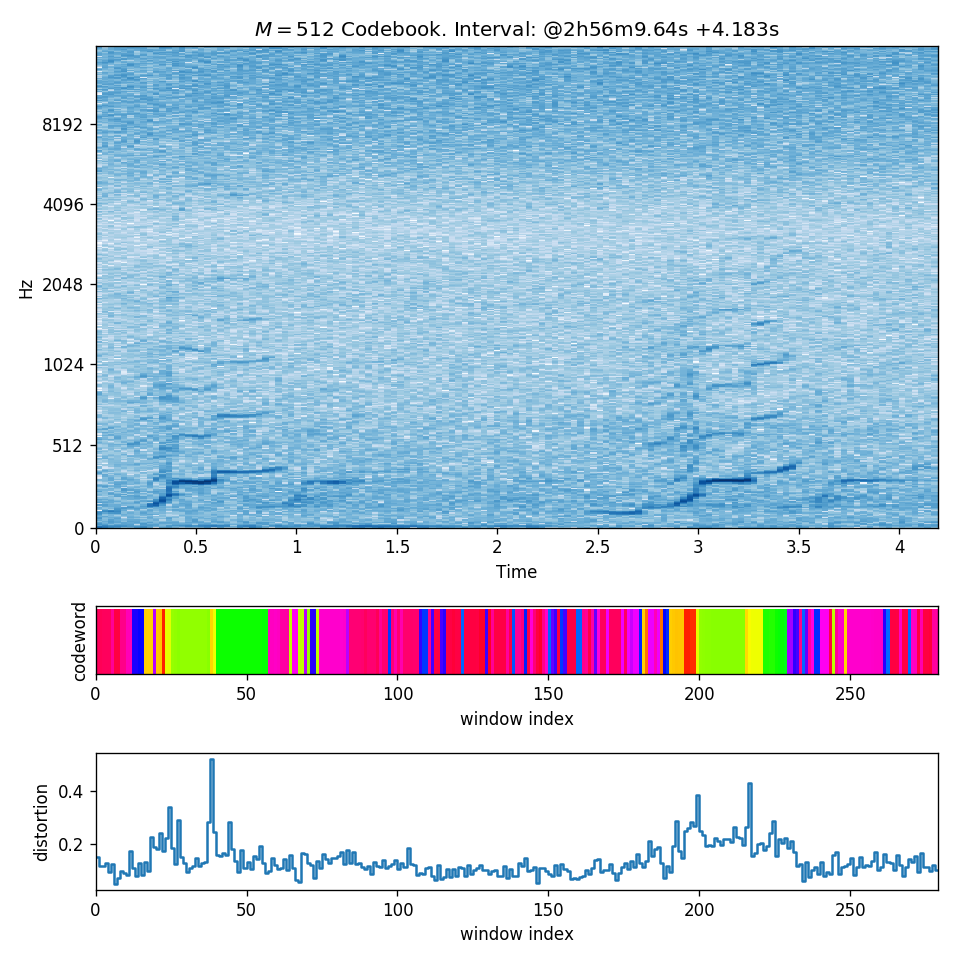

**Note**. In this case, the source sound file:
 
    532M ~/Downloads/MARS_20161221_000046_SongSession_16kHz_HPF5Hz/MARS_20161221_000046_SongSession_16kHz_HPF5Hz.wav
 
is located outside of this repository.
This sound has a 50 Db amplification (using Audacity) wrt to the one provided.

Also, the generated data is for the moment *not* included in the repo; 
only included are the resulting plots as referenced in this page. 
 
## LPC analysis

    $ lpc -P 36 ~/Downloads/MARS_20161221_000046_SongSession_16kHz_HPF5Hz/MARS_20161221_000046_SongSession_16kHz_HPF5Hz.wav
    Number of classes: 1
    class 'MARS_20161221_000046_SongSession_16kHz_HPF5Hz': 1
      /Users/carueda/Downloads/MARS_20161221_000046_SongSession_16kHz_HPF5Hz/MARS_20161221_000046_SongSession_16kHz_HPF5Hz.wav
    lpaOnSignal: P=36 numSamples=266117287 sampleRate=16000 winSize=720 offset=240 T=1108820
    data/predictors/MARS_20161221_000046_SongSession_16kHz_HPF5Hz/MARS_20161221_000046_SongSession_16kHz_HPF5Hz.prd: 'MARS_20161221_000046_SongSession_16kHz_HPF5Hz': predictor saved

## Codebook generation
    
1,108,820 training vectors.
     
    $ vq.learn -P 36 -e 0.0005 data/predictors/MARS_20161221_000046_SongSession_16kHz_HPF5Hz/MARS_20161221_000046_SongSession_16kHz_HPF5Hz.prd

Plot general evaluation:

    $ cb.plot_evaluation.py data/codebooks/_/eps_0.0005.rpt.csv
           M  passes     DDprm          σ       inertia
    0      2       9  0.386237   1.258410  2.628891e+06
    1      4      11  0.287822   2.472050  2.102332e+06
    2      8      17  0.233958   3.860611  1.814950e+06
    3     16      18  0.200205   5.168959  1.664952e+06
    4     32      18  0.171203   7.026399  1.554185e+06
    5     64      14  0.151517   8.694152  1.488529e+06
    6    128      17  0.137004  10.754301  1.444406e+06
    7    256      15  0.126080  12.613927  1.412817e+06
    8    512      14  0.117340  14.281844  1.388907e+06
    9   1024      14  0.109883  15.773080  1.369188e+06
    10  2048      14  0.103179  17.328352  1.351842e+06

    

Cell cardinality and distortions for M=1024 as a scatter plot:

    $ cb.plot_cards_dists.py --scatter data/codebooks/_/eps_0.0005_M_1024.cbook.cards_dists.csv

    

Extract  k_1 and k_2 from the training vectors:

    $ prd.show -k -r 1-2 data/predictors/MARS_20161221_000046_SongSession_16kHz_HPF5Hz/MARS_20161221_000046_SongSession_16kHz_HPF5Hz.prd > k1k2.csv
    
and from the codebooks:

    $ for M in 0002 0004 0008 0016 0032 0064 0128 0256 0512 1024; do
        cb.show -r 1-2 data/codebooks/_/eps_0.0005_M_$M.cbook > data/codebooks/_/eps_0.0005_M_$M.cbook.kk.csv
    done

With the above set of reflection coefficients, let's generate a few "k_1 vs. k_2"
scatter plots:

    $ for M in 0002 0008 0032 0128 0512; do
        cb.plot_reflections.py k1k2.csv data/codebooks/_/eps_0.0005_M_$M.cbook.kk.csv
    done

(Note: A maximum of 8000 training vectors, randomly chosen in each case, are plotted.)

M=2:
 

M=8:

M=32:

M=128:

M=512:

Similar reflection coefficient inspection but now with 3 coefficients,
and with the M=1024 codebook:
    
    $ prd.show -k -r 1-3 data/predictors/MARS_20161221_000046_SongSession_16kHz_HPF5Hz/MARS_20161221_000046_SongSession_16kHz_HPF5Hz.prd > kkk.csv
    
    $ cb.show -r 1-3 data/codebooks/_/eps_0.0005_M_1024.cbook > data/codebooks/_/eps_0.0005_M_1024.cbook.kkk.csv
    
    $ cb.plot_reflections.py kkk.csv data/codebooks/_/eps_0.0005_M_1024.cbook.kkk.csv
    df_training points = 1108820
    df_training plotted points = 8000
    df_codebook points = 1024

## Codebook assignment visualization

Selected intervals done by visually inspecting the spectrogram of the input 
signal using Audacity.
Each desired interval is defined by a start time (wrt to beginning of the file),
e.g., `2h0.941s` (2 hours and 0.941 seconds), and a duration e.g., `4.057s`.

Each of the following plots consists of:

- Spectrogram of the selected interval.
- Corresponding codeword per time window displayed with an arbitrary color mapping. 
  The intent here is to have an idea about the codeword assignment over time
  while expecting to see some similarity when comparing regions with similar acoustic content.
- Corresponding distortion per time window.

(Note: the axes of the codeword and distortion subplots are in terms of the
window index, but aligned with the time axis of the spectrogram subplot.) 

Two similar regions within (2h0.941s, +4.057s):

    $ sgn.select.py --mindists data/codebooks/_/eps_0.0005_M_0512.cbook.min_dists.csv \
      --signal ~/Downloads/MARS_20161221_000046_SongSession_16kHz_HPF5Hz/MARS_20161221_000046_SongSession_16kHz_HPF5Hz.wav \
      --plot 2h0.941s 4.057s

Two other similar regions within (2h56m9.64s +4.183s):

    $ sgn.select.py --mindists data/codebooks/_/eps_0.0005_M_0512.cbook.min_dists.csv \
      --signal ~/Downloads/MARS_20161221_000046_SongSession_16kHz_HPF5Hz/MARS_20161221_000046_SongSession_16kHz_HPF5Hz.wav \
      --plot 2h56m9.64s 4.183s

